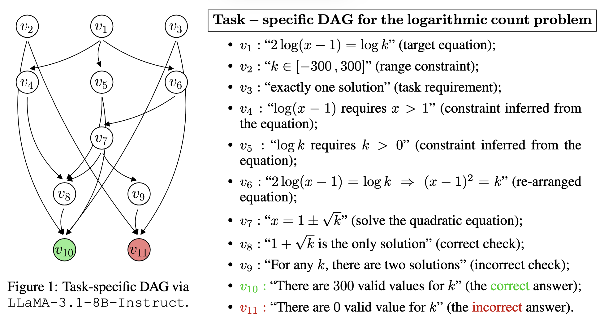
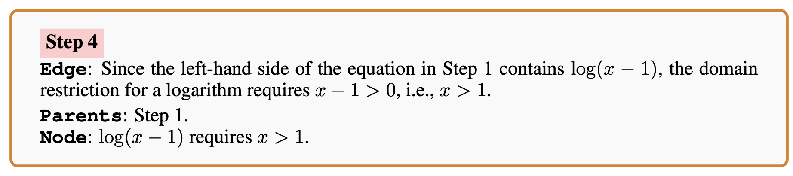

Успех в математических рассуждениях кроется в появление CoT

Вопрос как контролировать CoT, приводится 3 подхода:

1. Поиск
2. Вероятностный вывод
3. Пропозициональная логика

**PASS@1**<span style="color: rgb(15, 17, 21);"> — это метрика точности финального ответа: доля задач, в которых модель дала правильный итоговый ответ с </span>**одной**<span style="color: rgb(15, 17, 21);"> попытки</span>

Проблема в том, что из неверных выводов можно прийти к верным результатам

Классически:

1. (Pretrain) Модель обучают понимать текст (угадывать следующее слово)
2. (SFT, instruction tuning) Модель дообучают генерировать текст с правильным размышлением и ответом (предсказывать не слово, а целый текст с правильным ответом)
3. (RL) Модель учат отвечать правильно, уже не так важно как она размышляла

# Предлагаемая модель

> ```
> Logarithmic Count Problem (LCP)
> For how many integers k ∈ [−300, 300] does the equation 
> 2 log(x − 1) = log k have exactly one real solution x?
> ```

В работе предлагают моделировать рассуждения следующим образом:

Для каждой задачи строится свой DAG G(xin)=(V,E):

- **Узел (Node)** — это отдельный вывод/утверждение (например, «log⁡(x−1) требует x&gt;1»).

- **Ребро (Edge)** — это обоснование/правило, по которому из предыдущих узлов получается новый.

- Узлы делятся на три класса:

  - Vin​ — source-узлы, данные прямо из условия задачи;

  - Vinter— промежуточные выводы;

  - Vout​ — sink-узлы, то есть финальные ответы (правильный и, возможно, неправильный).

Предполагается, что граф **ацикличен** (Assumption 1), то есть нет циклических зависимостей

Модель в процессе может сомневатьси и перебирать варианты, но итоговый должен характеризоваться предложенной схемой (если он правильный)

Предлагается такой формат оформления:\
Номер шага, ребро (размышление), из какого следует, какой вывод делается

Авторы составили 2 894 Gold-Standard DAG (соответствует схеме, нет не использованных узлов, ответ правильный)  из Omni-MATH<span style="color: rgb(15, 17, 21);"> (уровни сложности 1–6).</span>

Сделали выводы, что сложность растет за счет ветвлений.

По экспериментам, авторы делают вывод, что 

<span style="color: rgb(15, 17, 21);">PASS@1 может вводить в заблуждение: модель может «угадать» ответ через поиск, но не строить логически замкнутое рассуждение. DAG-метрики дают более честную диагностику того, где модель реально рассуждает, а где просто перебирает варианты</span>